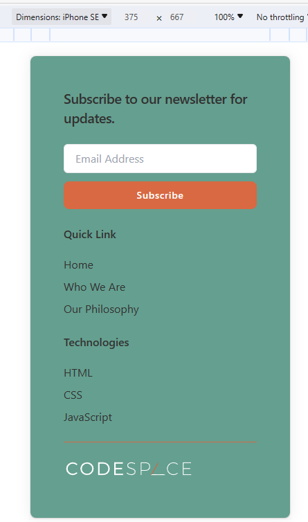

# [SDF04] Challenge: HTML Responsive Footer 🖼️

Welcome to your **HTML and CSS challenge!** This project is focused on applying all you've learned to design a fully responsive website footer.  

## 🚀 Technologies Used

- HTML & CSS
- VS Code with Live Server
- Git & GitHub

## 🎯 Learning Goals
- **Use semantic and accessible HTML** to structure the footer properly.  
- **Write all CSS in a separate `styles.css` file** (No inline styles).  
- **Ensure the footer adapts to different screen sizes**, following the provided reference images.  
- **Apply correct spacing, typography, and layout styling**.  
- **Include a newsletter subscription section, quick links, and optional social media icons**.  
 

## 🎨 Project Preview
   

