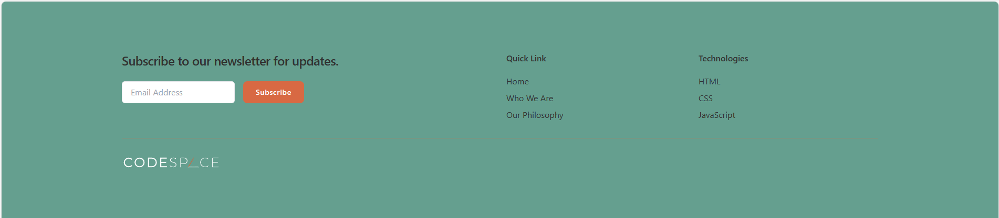

# Responsive Footer Challenge – CodeSpace SDF04 🖼️

This project is part of the CodeSpace Full-Stack Web Development Bootcamp. The goal is to design a fully responsive and accessible website footer using semantic HTML and modern CSS practices.

Welcome to your **HTML and CSS challenge!** This project is focused on applying all you've learned to design a fully responsive website footer.  

## 📚 Table of Contents
- Overview
- Technologies Used
- Features
- Getting Started
- Project Structure
- Screenshots
- License

## 📝 Overview
The Responsive Footer Challenge focuses on implementing a website footer that adapts seamlessly across various screen sizes. Key objectives include:
- Utilizing semantic HTML elements for better accessibility.
- Separating CSS into an external styles.css file.
- Ensuring responsiveness using media queries.
- Incorporating a newsletter subscription form, quick links, and social media icons.

## 🛠️ Technologies Used
- HTML5
- CSS3
- Visual Studio Code with Live Server
- Git & GitHub

## ✨ Features
- Responsive Design: Footer adjusts layout based on screen size.
- Accessibility: Semantic HTML ensures screen reader compatibility.
- Newsletter Subscription: Users can input their email to subscribe.
- Quick Links: Navigation links for easy access to site sections.
- Social Media Icons: Placeholder icons for various platforms.

## 🚀 Getting Started
1. Clone or download this repository
    ```bash
    git clone https://github.com/yarlinlynn/YARSTR25495_FTO2505-B_Yarlin-Struis_SDF04.git
2. Navigate to the project directory:
    ```bash
    cd YARSTR25495_FTO2505-B_Yarlin-Struis_SDF04
3. Open index.html in your browser:
    ```bash
    You can use Live Server in VS Code for real-time viewing.
</br>

## 📁 Project Structure
├── index.html                # Main HTML file
├── assets/
│   └── css/
│       └── styles.css        # External stylesheet
└── README.md                 # Project documentation

## 📸 Demo Screenshot


## 📄 License
This project is for educational purposes only as part of my bootcamp training.